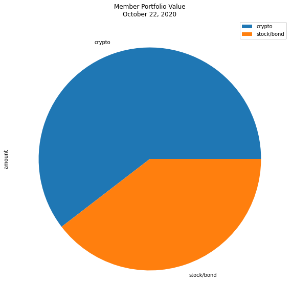
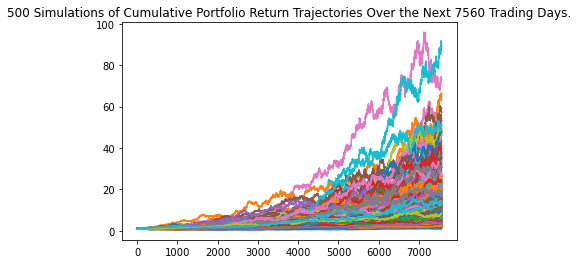
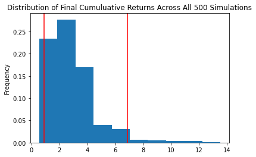
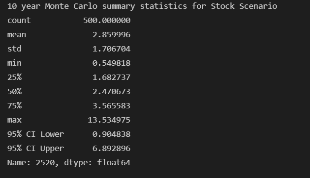

# Fintech Financial Planning Tool

Prototype for a credit union showing tools to help clients evaluate both their emergency fund and retirement
readiness.

## Technologies

The application uses the following technologies:

- Python 3.7
- [pandas](https://pandas.pydata.org/pandas-docs/stable/index.html)
- [Jupyter Lab](https://jupyter.org/)
- Trilogy Education Services Monte Carlo Forecast Tools
- [Alpaca Trading API](https://github.com/alpacahq/alpaca-trade-api-python/)

## Installation Guide

```python

pip install numpy
pip install pandas
pip install matplotlib
pip install python-dotenv
pip install alpaca-trade-api

```

### Jupyter

The application is based on a Jupyter Notebook. The minimum required is a Jupyter Notebook but Jupyter Lab can be installed as well.  Please review the [Jupyter installation instructions](https://jupyter.org/install)

## Usage

### Startup

- Launch Jupyter (or compatible IDE like Visual Studio Code)
- Load **risk_return_analysis.ipynb** and select **Run => Restart Kernal and Run all Cells** from the menu

### Inputs

The initial iteration of the project is a prototype for a credit union, so inputs were entered in code.  The
prototype modeled a credit union member with bitcoin and ethereum cryptocurrency holdings; SPDR S&P 500 ETF
Trust (SPY) and iShares Core US Aggregate Bond ETF (AGG) holdings; and a monthly income of $12,000 USD.  In
a production environment savings data would be input from a credit union data source.  Inputs for this
prototype included:

- Cryptocurrency holdings (set: btc_coins, eth_coins)
- Stock and bond holdings (set: spy_shares, agg_shares)
- Credit union member income (set: monthly_income)

### Analsyis Output Examples

The data was loaded into a pandas DataFrame and various types of analysis were conducted to determine the
recommendations for emergency fund and retirement plan strategies.  Types of analysis included:

- Emergency fund health based on current holdings and monthly income
- Retirement plan strategies using simulations that varied by time and asset class weighting









## Brief Analysis Review

Analysis of the sample credit union member's retirement showed that shifting from a traditional 30 year time horizon
with a 60% stock, 40% bond strategy to a 10 year 80% stock, 20% bond strategy does not enable a member to retire 
early.

## Contributors

- Jacob Rougeau

## License

MIT
